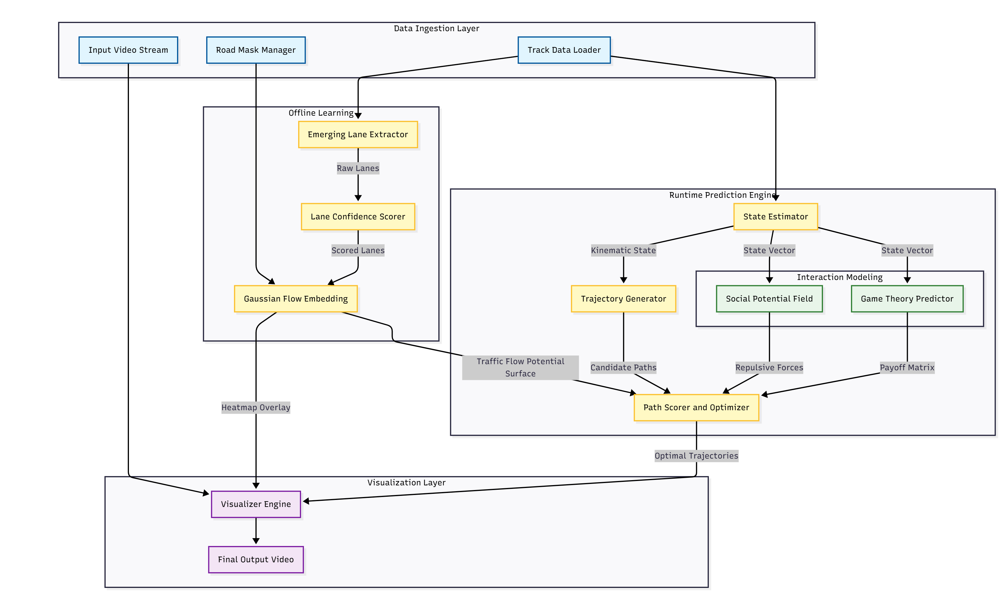
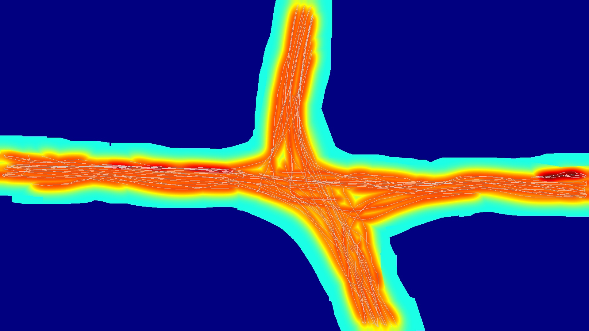
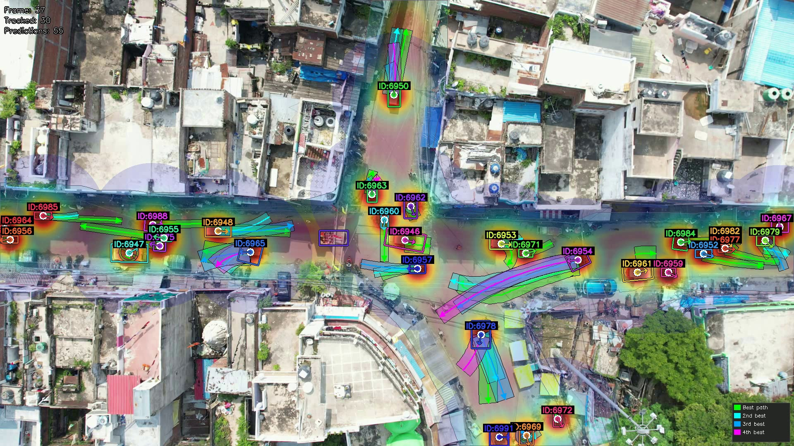
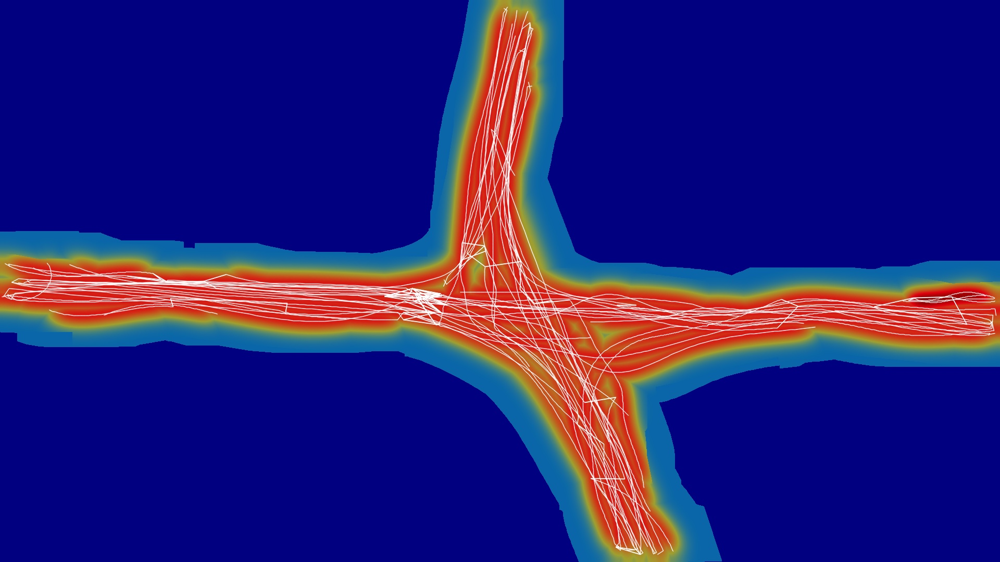
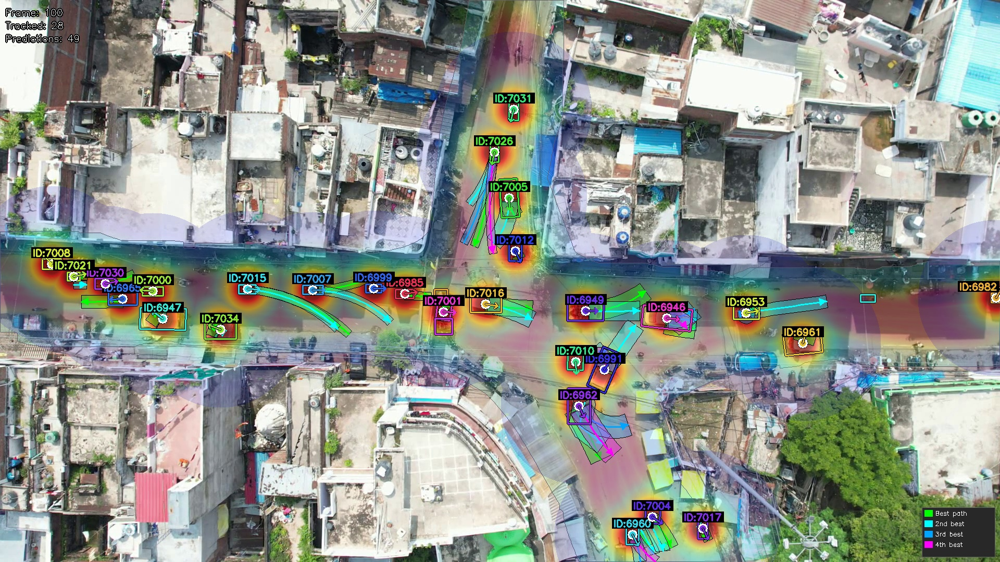

# Behavior Aware Trajectory Prediction in Unstructured Indian Traffic through Probabilistic Flow Embedding:

**Creator:** Mridankan Mandal

## Abstract:
This project presents a deterministic framework for predicting vehicle trajectories in highly unstructured traffic environments where lane discipline is weak or non-existent. Unlike traditional lane-based predictors, this system introduces a **Probabilistic Traffic Flow Potential Surface**, generated by embedding extracted vehicle trajectories into a continuous scalar field using Gaussian splatting. This 'flow field' replaces discrete lane lines, allowing the system to model traffic as a fluid region of varying probability. By integrating this flow model with **Social Potential Fields** for collision avoidance and **Game Theoretic** logic for cooperative interaction, the framework generates realistic, multi-modal path predictions that respect both the static road geometry and the dynamic social context.

## 1. Introduction:
Trajectory prediction is a cornerstone of autonomous navigation and advanced traffic monitoring. In structured environments, vehicles follow well defined lanes, making rule based or map based prediction relatively straightforward. However, in unstructured traffic scenarios (like intersections in developing countries), vehicles often ignore lane markings, creating 'emerging lanes' based on collective behavior rather than static infrastructure.

This system addresses these challenges by:
1.  **Mining Emerging Lanes:** Automatically extracting common travel corridors from historical tracking data.
2.  **Modeling Continuous Flow:** Converting these corridors into a continuous probability surface, allowing for loose lane adherence.
3.  **Simulating Interactions:** Using potential fields and game theory to model how vehicles negotiate space.

The result is a predictor that functions effectively without high definition maps, relying instead on the "memory" of past traffic flow.

## 2. System Architecture:

The following diagram shows the high level data flow and component interaction within the system.


*Figure 1: High level architecture of the Behavior Aware Trajectory Prediction System. The pipeline consists of three main stages: Data Ingestion, Pre-Processing (Offline Learning), and the Runtime Prediction Engine. The system ingests video and tracking data to learn emerging lanes, which are then converted into a probabilistic flow field. At runtime, this field is combined with social potential fields and game-theoretic logic to generate and score candidate trajectories.*

## 3. Methodology:

### 3.1. Emerging Lane Extraction, and Probabilistic Embedding:
To handle unstructured traffic, the system first "learns" where vehicles actually drive.
*   **Trajectory Clustering:** Raw vehicle tracks are smoothed using a Savitzky Golay filter. We then employ a **Hausdorff Distance** metric to identify spatially similar tracks.

$$ d_H(A, B) = \max \left( \sup_{a \in A} \inf_{b \in B} d(a, b), \sup_{b \in B} \inf_{a \in A} d(a, b) \right) $$


Tracks within a tight threshold (like 3.0 pixels) are merged into a single representative 'emerging lane'.
*   **Confidence Scoring:** Not all extracted lanes are equal. We assign a confidence score $C_{lane}$ based on the number of supporting tracks ($N_{support}$), ensuring that heavily traveled paths exert a stronger influence on prediction.

$$ C_{lane} = \min\left(1.0, 0.3 + 0.7 \cdot \frac{N_{support}}{N_{max}}\right) $$

*   **Gaussian Splatting:** Instead of treating lanes as binary lines, we embed them into the road mask as Gaussian distributions. This creates a **Traffic Flow Potential Surface** $P(x)$, where pixel intensity represents the probability of traffic flow.

$$ P(x) = \sum_{k} C_k \cdot \exp\left(-\frac{dist(x, lane_k)^2}{2\sigma^2}\right) $$


This surface allows the predictor to favor paths that follow the "flow" while permitting deviations necessary for overtaking or avoidance.


*Figure 2: Visualization of the Traffic Flow Potential Surface. The heatmap represents the probability density of vehicle presence, derived from historical tracking data. Warmer colors (red/orange) indicate high traffic corridors, while cooler colors (blue/green) represent lower probability areas. This continuous surface replaces discrete lane markings, allowing for flexible path planning.*

### 3.2. Kinematic State Estimation:
For each vehicle $i$, the state vector $S_i = [x, y, v_x, v_y, a_x, a_y, \theta, \omega]^T$ is estimated from historical positions.
Velocity $v$ and acceleration $a$ are derived using finite differences, and angular velocity $\omega$ is computed to capture turning rates, which is essential for predicting curvilinear maneuvers.

### 3.3. Social Potential Fields:
To model the repulsive influence of nearby vehicles, we utilize Social Potential Fields. A potential function $U(x)$ is defined around each obstacle vehicle $j$.

$$ U_j(x) = A_{risk} \cdot \exp\left(-\frac{||x - p_j||^2}{2\sigma_{social}^2}\right) $$

The total potential at any point is the superposition of individual fields. This field is used to penalize candidate paths that traverse high risk regions, effectively modeling collision avoidance behavior.

### 3.4. Game Theoretic Interaction Modeling:
Interactions at conflict points (like intersections) are formulated as non-cooperative games. A payoff matrix determines the optimal strategy (Yield or Pass) for the ego vehicle.
The payoff function $J$ considers safety, efficiency, and right-of-way rules.

$$ J(s_i, s_j) = w_1 \cdot T_{clearance} + w_2 \cdot V_{avg} + w_3 \cdot P_{priority} $$

Based on the Nash Equilibrium of the game, the predicted velocity profile is adjusted to reflect cooperative behaviors such as yielding or accelerating.

### 3.5. Trajectory Optimization:
A diverse set of candidate trajectories $\mathcal{T}$ is generated using parametric curves (constant velocity, constant acceleration, curvilinear). Each candidate $\tau$ is evaluated using a multi-objective scoring function:

$$ Score(\tau) = P_{base} \cdot F_{flow}(\tau) \cdot F_{social}(\tau) \cdot F_{kinematic}(\tau) \cdot F_{game}(\tau) $$

*   **$F_{flow}$:** Integral of the Traffic Flow Potential Surface along the path.
*   **$F_{social}$:** Inverse exponential of the accumulated social potential.
*   **$F_{kinematic}$:** Smoothness and physical feasibility constraints.
*   **$F_{game}$:** Cooperative payoff score.

## 4. Implementation Details:
*   **Language:** Python 3.8+.
*   **Core Libraries:** NumPy (Vectorized math), OpenCV (Image processing/Visualization), SciPy (Spatial distance metrics).
*   **Visualization:** The system renders the Traffic Flow Potential Surface as a heatmap (JET colormap) overlaid on the video. Predicted trajectories are drawn as semi-transparent splines, with color coding indicating the confidence ranking.

## 5. Usage:
1.  **Configuration:** Update `config.py` with paths to your video, tracking CSV, and road mask JSON.
2.  **Run:**.
    ```bash
    python main.py --frames 400
    ```
    This will process the first 400 frames, extracting lanes, building the potential surface, and generating predictions.
3.  **Output:** Results are saved to `output/predictions/` as an MP4 video.

## 6. Evaluation Results:

The system was evaluated on the validation and test splits of the ChunkedProjectPrayagBEVDataset (30Hz) and ChunkedProjectPrayagBEVDataset10Hz (10Hz). Additionally, a cross-dataset evaluation was performed using 10Hz data for prediction but with lane extraction from the 30Hz dataset (10Hz+30Hz Lanes). The metrics used are Minimum Average Displacement Error (minADE), Minimum Final Displacement Error (minFDE), Collision Rate, and Off-Road Rate.

| Metric | Val (30Hz) | Val (10Hz) | Val (10Hz+30Hz Lanes) | Test (30Hz) | Test (10Hz) | Test (10Hz+30Hz Lanes) |
| :--- | :--- | :--- | :--- | :--- | :--- | :--- |
| **Samples** | 519 | 588 | 578 | 756 | 877 | 862 |
| **minADE@1** | 20.52 px | 23.88 px | 23.26 px | 22.45 px | 28.32 px | 29.99 px |
| **minADE@4** | 14.09 px | 16.02 px | 15.78 px | 16.83 px | 20.52 px | 21.10 px |
| **minFDE@1** | 34.61 px | 41.75 px | 40.85 px | 38.48 px | 49.19 px | 52.06 px |
| **minFDE@4** | 24.39 px | 29.03 px | 28.83 px | 30.06 px | 36.29 px | 37.33 px |
| **Miss Rate @10px** | 65.90% | 65.65% | 64.71% | 76.19% | 70.13% | 70.65% |
| **Miss Rate @20px** | 47.40% | 39.12% | 38.58% | 62.04% | 47.55% | 49.54% |
| **Norm FDE** | 0.7179 | 0.8335 | 0.8415 | 0.6666 | 0.7571 | 0.8138 |
| **APD (Diversity)** | 11.40 px | 13.75 px | 13.17 px | 12.25 px | 18.07 px | 17.45 px |
| **NLL (Probabilistic)** | 8.4556 | 8.8146 | 8.7896 | 8.6199 | 9.1269 | 9.1345 |
| **Collision Rate** | 3.08% | 5.27% | 5.88% | 3.04% | 6.39% | 6.61% |
| **Off-Road Rate** | 0.39% | 0.51% | 0.52% | 0.66% | 0.34% | 0.35% |

**Note on Sample Size:** The 10Hz dataset yields slightly more valid samples than the 30Hz dataset. This is likely because the lower frame rate and associated smoothing make the lane extraction and association slightly more robust, allowing the predictor to successfully generate trajectories for a few more difficult cases that are filtered out in the 30Hz pipeline.

**Note on Cross-Dataset Evaluation (10Hz+30Hz Lanes):** This configuration evaluates prediction at 10Hz while using lane structures extracted from the 30Hz dataset. This tests the system's ability to leverage higher-resolution lane information for lower-framerate prediction scenarios.

### Dataset Statistics
Based on the analysis of 11,593 vehicles across the dataset:
*   **Average Vehicle Length:** 35.08 pixels
*   **Average Vehicle Width:** 20.82 pixels

## 7. Visual Results:

The system's performance is validated through qualitative analysis of the generated predictions.


*Figure 3: Trajectory Prediction Output (30Hz). The system predicts multiple candidate paths for each vehicle (green/yellow lines), scored by their alignment with the traffic flow field and safety relative to other agents. The background heatmap visualizes the learned traffic flow potential, guiding predictions along established corridors even in the absence of lane markings.*

### 7.1. 10Hz Dataset Visualizations

The system's robustness is further demonstrated on the 10Hz dataset, showing consistent lane extraction and trajectory prediction even at lower frame rates.


*Figure 4: Traffic Flow Potential Surface (10Hz). The learned flow field remains coherent despite the reduced temporal resolution.*


*Figure 5: Trajectory Prediction Output (10Hz). Predictions maintain high fidelity and diversity, effectively navigating the unstructured environment.*

## 8. Conclusion:
The proposed system effectively predicts multi-modal vehicle trajectories by explicitly modeling the physical and social forces governing traffic flow. The shift from discrete lane lines to a probabilistic flow surface allows for a more natural representation of unstructured traffic, while the integration of game theory enables the anticipation of cooperative behaviors.


